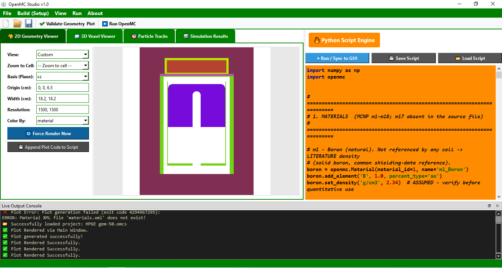
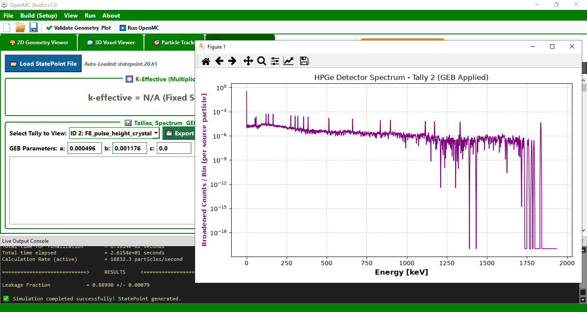

.. image:: https://zenodo.org/badge/1327182363.svg
  :target: https://doi.org/10.5281/zenodo.21878958

# OpenMC Studio

> **A modern Integrated Development Environment (IDE) for building, running, and visualizing OpenMC Monte Carlo simulations.**

**OpenMC Studio** is a graphical Integrated Development Environment (IDE) built to simplify reactor physics modeling, radiation transport simulations, shielding analysis, criticality calculations, and radiation-detector simulation using the **OpenMC** Monte Carlo code. Visualization is central to the tool: geometry, particle behavior, and results are all inspectable directly inside the application rather than through separate external scripts.

Developed by **Dr. Ayman Abu Ghazal**, OpenMC Studio combines an intuitive graphical interface with the flexibility of the OpenMC Python API, allowing users to create, edit, visualize, execute, and analyze OpenMC models within a single application.

---

## 🚧 Project Status

> **Beta Release**

OpenMC Studio is currently under active development.
Core functionality is operational; however, some features are still being refined and expanded. Minor bugs or interface changes may occur between releases.

Feedback, bug reports, and feature suggestions are highly appreciated.

---

## ✨ Features

**Materials**
- Built-in library of common reactor, shielding, and detector materials (water, heavy water, B₄C, lead, stainless steel 304/316, concrete, polyethylene, borated polyethylene, enriched UO₂, HPGe, NaI)
- Custom material builder — add nuclides or elements by atomic or weight fraction

**Geometry**
- CSG surface builder (sphere, Z-cylinder, X/Y/Z-plane) with undo history
- Quick-insert macrobody templates in the Geometry Builder (cylinder, box, sphere, truncated cone)

**Settings & Source**
- Fixed-source or eigenvalue run mode, with batches/particles/inactive-batch controls
- Point or volumetric (box) source definitions, with discrete or Watt fission-spectrum energy distributions
- Photon and electron/positron transport toggles
- Particle-tracking setup for visual trajectory inspection

**Tallies**
- Cell, material, energy, and mesh filters
- Dedicated pulse-height (detector, F8-equivalent) tally mode with Gaussian Energy Broadening (GEB) parameters, purpose-built for HPGe/NaI detector response simulation

**Visualization**
- 2D geometry plotting with fit-to-geometry and zoom-to-cell navigation
- GPU-accelerated 3D voxel rendering (PyVista), reflecting the actual script geometry
- **Real particle-track visualization** — source birth points, interaction/collision events, and trajectories rendered from OpenMC's native tracking output, with per-layer display toggles and animated playback
- Automatic statepoint loading and tally spectrum visualization with GEB calibration
  
 

**Workflow**
- Integrated Python script editor with syntax highlighting
- GUI actions across the Materials, Geometry, Settings, and visualization pages generate corresponding Python code directly into the script editor
- One-click execution of OpenMC simulations with live console output and progress monitoring
- Nuclear data library manager (cross-section path configuration and isotope explorer)
- Project save/load (`.omcs` / `.py`), with a full workspace reset on "New Project"

---

## 📋 Requirements

**Before running OpenMC Studio:**

- Python 3.10 or newer
- OpenMC Python API 0.15.x (tested with 0.15.3)
- ENDF/B (or equivalent) nuclear data files in HDF5 format, with the `OPENMC_CROSS_SECTIONS` environment variable pointing to their `cross_sections.xml` index — downloaded separately from OpenMC itself; see the [OpenMC data documentation](https://docs.openmc.org/en/stable/usersguide/data.html)
- A GPU-capable display driver for the 3D Voxel Viewer (PyVista/VTK-based; the rest of the application does not require one)

**Python packages** (installed via `requirements.txt`):

| Package | Used for |
|---|---|
| PySide6 | The graphical interface itself |
| openmc | The simulation engine binding |
| numpy | Array handling across the geometry, tracks, and voxel pages |
| matplotlib | 2D geometry rendering and Particle Track overlays |
| h5py | Reading generated `.h5` voxel plot files (3D Voxel Viewer) |
| pyvista / pyvistaqt | GPU-accelerated 3D rendering (3D Voxel Viewer) |

Exact package versions are not pinned in `requirements.txt` -- pip will resolve compatible versions for your Python install automatically.

> **Note:** don't confuse the `h5py` *Python package* above (which reads HDF5 files) with the nuclear data *files* themselves, which are also HDF5-formatted but are a separate, much larger download unrelated to `pip install`.

---

## 🚀 Installation

Clone the repository:

```
git clone https://github.com/AymanAbuGhazal/OpenMC-Studio.git
```

Go to the project directory:

```
cd OpenMC-Studio
```

Install the required packages:

```
pip install -r requirements.txt
```

Run the application:

```
python main.py
```

---

## 📦 Building a Standalone Executable

OpenMC Studio can be packaged into a standalone Windows executable using PyInstaller:

```
pip install pyinstaller pyinstaller-hooks-contrib
pyinstaller --clean OpenMC-Studio.spec
```

The build results appear in `dist/OpenMC-Studio/`.

> ⚠️ **Known issue — build with Python 3.11, not 3.12.** scipy has a confirmed
> incompatibility with PyInstaller specifically under Python 3.12
> (see [pyinstaller/pyinstaller#7992](https://github.com/pyinstaller/pyinstaller/issues/7992),
> closed as a scipy-side issue, not PyInstaller's). It surfaces as:
> ```
> NameError: name 'obj' is not defined
>   File "scipy/stats/_distn_infrastructure.py", line 370, in <module>
>     del obj
> ```
> This has not yet been fixed in scipy (confirmed present through at least
> scipy 1.18.0). Build from a Python 3.11 virtual environment to avoid it —
> Python 3.11 remains fully supported for running the application itself.

---

## 📖 Citation

If you use OpenMC Studio in research or academic publications, please cite:

```
Abu Ghazal, A. (2026).
OpenMC Studio: A Modern Integrated Development Environment for OpenMC Monte Carlo Simulations.
Computer Software.
https://github.com/AymanAbuGhazal/OpenMC-Studio
```

---

## 🤖 Development Note

The architecture, physics logic, and feature design of OpenMC Studio were conceived and directed by the author throughout development. AI coding assistants — Google Gemini Pro and Claude Pro — were used as implementation tools: generating, structuring, and debugging the underlying Python and PySide6 code under that direction. This is noted here in the interest of transparency, consistent with growing norms around AI-assisted development in scientific software.

---

## 📄 License

This project is released under the **MIT License**.

---

## 👨‍💻 Developer

**Dr. Ayman Abu Ghazal**
GitHub: https://github.com/AymanAbuGhazal



---


## 🤝 Contributing

Contributions, bug reports, feature requests, and suggestions are welcome.
If you encounter an issue or have an idea for improving OpenMC Studio, please open an Issue or submit a Pull Request.

## Acknowledgments
Special thanks to Sachin Shet for providing the Windows-compiled binaries of OpenMC (available: https://shetsdp.github.io/blogs/openmc-windows.html), which served as the core engine for this standalone GUI.
---

## ⚠️ Disclaimer

OpenMC Studio is an independent open-source project developed by **Dr. Ayman Abu Ghazal**.
It is **not** an official product of the Jordan Atomic Energy Commission (JAEC) and does **not** represent the official policies, positions, or endorsements of the JAEC.

* DOI integration setup via Zenodo.
